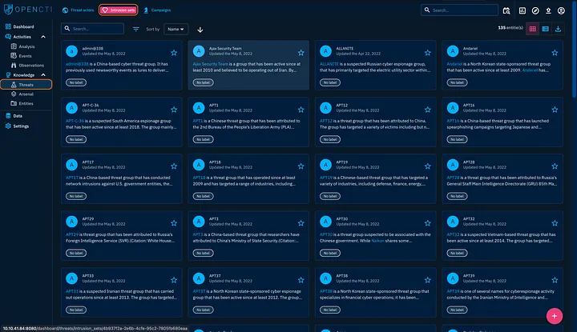
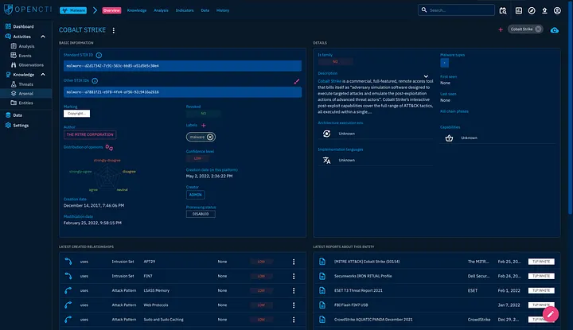

#  OpenCTI Dashboard & Navigation Overview   

## 1. Dashboard  
Displays widgets summarizing total entities, relationships, reports, and observables, including 24-hour updates.  

---

## 2. Activities & Knowledge  
- **Activities:** Lists incident reports for investigation.  
- **Knowledge:** Links data on adversaries, tools, victims, and campaigns.  

---

## 3. Analysis  
Shows reports, external references, and notes for threat analysis (e.g., MITRE ATT&CK reports).  

---

## 4. Events  
Used to record and analyze suspicious or malicious network activities and connect related incidents.  

---

## 5. Observations  
Lists technical elements, detection rules, and artifacts from attacks for mapping and correlation.  

---

## 6. Threats  
Includes:  
- **Threat Actors:** Individuals or groups conducting attacks.  
- **Intrusion Sets:** TTPs and tools used by threat groups.  
- **Campaigns:** Coordinated attacks over a specific period.
  
  

---

## 7. Arsenal  
Covers:  
- **Malware:** Known malicious software (e.g., 4H RAT).  
- **Attack Patterns:** Adversary techniques and behaviors.  
- **Courses of Action (CoA):** Defensive mitigations.  
- **Tools:** Legitimate or abused admin tools (e.g., CMD).  
- **Vulnerabilities:** Software flaws (imported CVEs).  

---

## 8. Entities  
Categorizes information by sectors, countries, organizations, and individuals for contextual enrichment.  

---

## 9. General Tabs Navigation  
Helps users explore entities (e.g., Cobalt Strike) through the **Overview Tab**, showing ID, confidence, and relations.  

---

## 10. Knowledge Tab  
Displays linked reports, indicators, relationships, and attack pattern timelines with detailed entity context.  

---

## 11. Analysis Tab  
Lists reports referencing the selected entity, providing actionable intelligence for investigations.  

---

## 12. Indicators, Data & History Tabs  
- **Indicators:** IOCs identified for threats and entities.  
- **Data:** Uploaded or exported files for sharing threat intel.  
- **History:** Tracks all entity changes and relationship updates.  

---

###  Tags  
#OpenCTI #ThreatIntelligence #CyberSecurity #CTI #SOC #BlueTeam #MalwareAnalysis #MITREATTACK
